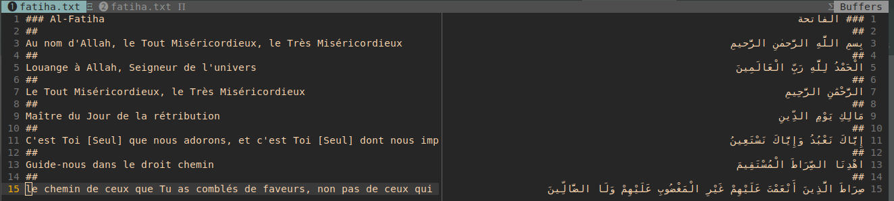

# Projet de numérisation des Xassidas en arabe

Ce projet a pour but de numériser les Xassidas, des poèmes religieux chantés dans les confréries soufies du Sénégal. Les Xassidas sont une partie importante de la culture sénégalaise et de la pratique religieuse soufie, et leur numérisation permettra de les rendre plus accessibles à un public plus large.

## Technologies utilisées

Ce projet utilise les technologies suivantes :
- OCR si (Optical Character Recognition) pour la reconnaissance des caractères arabes à partir d'images numérisées
- Python pour les mettre en format consommable par l'API
- Git et Github pour le contrôle de version et le partage du code

## Étapes du processus de numérisation

1. Sélectionner les Xassidas
2. Numériser les Xassidas en utilisant un scanner ou un appareil photo de haute qualité.
3. Utiliser l'OCR pour extraire les caractères arabes à partir des images numérisées.
4. Vérifier et corriger les erreurs de reconnaissance des caractères manuellement (**les accents surtout**).
5. Organiser les Xassidas en fonction des tariha et auteurs.

## Contributions

Les contributions sont les bienvenues! Si vous souhaitez contribuer à ce projet, voici quelques suggestions :
- Ajouter des Xassidas supplémentaires à la base de données.
- Corriger et ajouter les versions numériques déjà existantes.
- Voir le format à respecter ci-dessous

## Format à Respecter

Les xassidas et leur traductions (si disponible) doivent respecter ce format

- **Les Chapitres** commencent par trois(3) **Diez(#)**

- **Les versets** doivent être séparés par deux(2) **Diez(#)**
  
  Ex:



## Pour les Developpeurs

**Requirements**

- **Python 3.9 ou Supérieur**

## Structure des fichiers

```bash
└── xassidas
    ├── mouride
    └── tidjian
        ├── maodo
        │   ├── abada
        │   │   └── abada.txt
        │   ├── allahou_hasbi
        │   │   └── allahou_hasbi.txt
        │   ├── bourdou
        │   │   └── bourdou.txt
        │   └── xassidas.json
        ├── serigne-babacar
        └── serigne-cheikh
            └── abouna
                ├── abouna.json
```

## Pour les Developpeurs
  Un script permet d'automatiquement générer les transciptions pour ce faire,
  le respect de accent(mass) est obligatoire.

  **Dans le dossier parser**

+ **parse_xassida.py**:
  
    Ce script sera utilisé pour extraire les xassidas et leur traductions en
    format json.
  
    ```bash
    python parse_xassida.py [-t tariha] [-a auteur] [-x xassida]
    ```
    json output
    ```json
    {
      "name": "sample",
      "chapters": [
        {
          "name": "الفاتحة",
          "number": 1,
          "verses": [
            {
              "number": 0,
              "key": "1:0",
              "text": "بِسْمِ اللَّهِ الرَّحْمَٰنِ الرَّحِيمِ",
              "words": [
                {
                  "position": 0,
                  "text": "بِسْمِ",
                  "transcription": "bismi"
                },
                {
                  "position": 1,
                  "text": "اللَّهِ",
                  "transcription": "l-lahi"
                },
                {
                  "position": 2,
                  "text": "الرَّحْمَٰنِ",
                  "transcription": "r-raḥmāni"
                },
                {
                  "position": 3,
                  "text": "الرَّحِيمِ",
                  "transcription": "r-raḥīmi"
                }
              ],
              "translations": []
            },
            ...
          ],
        },
        ...
      ],
      "translated_names": [],
      "audios": [],
      "translated_lang": []
      }
     ```
  
+ **parse_translation.py**:
  
    Ce script sera utilisé pour extraire les traductions s'ils existent.
  
  ```bash
  python parse_translations.py [-t tariha] [-a auteur] [-x xassida]
  ```
  **json output**
  ```json
  {
    "name": "sample",
    "chapters": [
      {
        "name": "الفاتحة",
        "number": 1,
        "verses": [
          {
            "number": 0,
            "key": "1:0",
            "text": "بِسْمِ اللَّهِ الرَّحْمَٰنِ الرَّحِيمِ",
            "words": [
              {
                "position": 0,
                "text": "بِسْمِ",
                "transcription": "bismi"
              },
              {
                "position": 1,
                "text": "اللَّهِ",
                "transcription": "l-lahi"
              },
              {
                "position": 2,
                "text": "الرَّحْمَٰنِ",
                "transcription": "r-raḥmāni"
              },
              {
                "position": 3,
                "text": "الرَّحِيمِ",
                "transcription": "r-raḥīmi"
              }
            ],
            "translations": [
              {
                "lang": "fr",
                "text": "In the name of Allah, the Entirely Merciful, the Especially Merciful.",
                "author": ""
              }
            ]
          },
          ...
        ]
      },
      ...
    ],
    "translated_names": [],
    "audios": [],
    "translated_lang": []
  }
  ```
## Licence

Ce projet est sous licence MIT. Veuillez consulter le fichier LICENSE pour plus d'informations.


